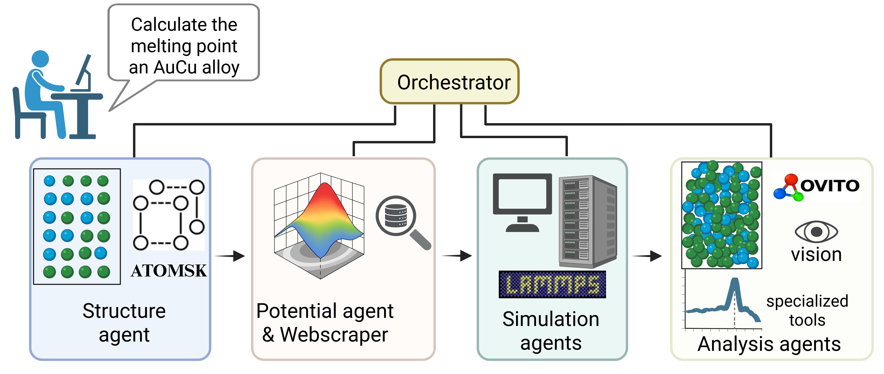

# Multi-Agentic AI Framework for End-to-End Atomistic Simulations

Autonomous multi-agent AI system coordinates specialized agents to perform complex materials property calculations from natural language prompts.




## Installation

You can install and run LAMMPS-Agents either locally using Conda or via Docker.

### Method 1: Local Installation with Conda

1. Clone the repository:
```bash
git clone https://github.com/ANL-NST/LAMMPS-Agents.git
cd LAMMPS-Agents
```

2. Create and activate a new conda environment:
```bash
conda create -n lammps-agents python=3.11
conda activate lammps-agents
```

3. Install dependencies:
```bash
pip install -r requirements.txt
```

4. Set up your environment variables:
```bash
# Create a .env file from the template
cp .env.example .env
# Edit the .env file with your API keys and configuration
```

### Method 2: Docker Installation

1. Clone the repository (if you haven't already):
```bash
git clone https://github.com/ANL-NST/LAMMPS-Agents.git
cd LAMMPS-Agents
```

2. Build the Docker image:
```bash
docker build -t lammps-agents:latest .
```

3. Run the container:
```bash
# Run interactively with a bash shell
docker run -it lammps-agents:latest bash

# Or run directly
docker run -it lammps-agents:latest python3 lammps_agents.py
```

Note: If you're using the Docker method, the environment variables should be configured in the Dockerfile or passed during the docker run command using the -e flag:
```bash
docker run -it \
  -e OPENAI_API_KEY=your_key \
  lammps-agents:latest python3 lammps_agents.py
```


## Components

### Core Files
- `lammps_agents.py`: Main implementation of the pipeline using LAMMPS agents
- `src/system_messages`: Contains the system messages used to guide each of the agents
- `src/tools`: Contains the main tools and file systems


### Teachability Databases
- `teachability_db_gpt4o/`: Contains the ChromaDB with the saved input-output pairs after the human teachings using as a base model GPT-4o


## Examples
```
python lammps_agents.py

```

## Instructions to add a new agent
1. Update the `src/tools/agent_factory.py`
2. Update the `lammps_agents.py` with the new agents
3. Go to `src/tools/function_registry.py` to register any new functions to your agents.
4. Add a system message for the agent to explain the actions that can take and the available functions it has 


## Instructions to run on HPC
1. Update the `src/tools/specialized_tools/hpc_manager.py`